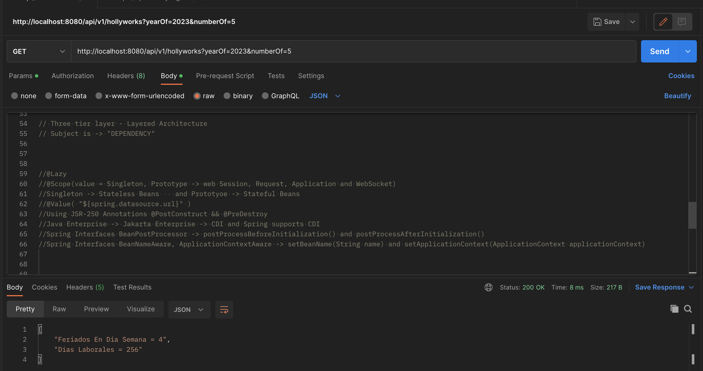

# ☕️ Días laborales en un año (Solucion Desafio)

## Contrato del API
``` yaml
openapi: 3.0.0
 info:
 title: OpenAPI document for HollyWorksDays Challenge.
 description: How many days we works on a bank.
 version: 1.0.10
paths:
 /api/v1/workdays:
  get:
   summary: Get the whole works days and holly days of a year.
   description: Retrieves the year of and the number of seeds holly days.
   parameters:
     - name: yearOf
       in: query
       required: true
       schema:
        type: integer
        format: int8
     - name: numberOF
       in: query
       required: true
       schema:
        type: integer
        format: int8
   responses:
    '200':
      description: A JSON array of user names
      content:
      application/json:
       schema:
        type: array
         minItems: 2
         maxItems: 2
        items:
         type: string
    '400':
      description: Invalid query Params
    '404':
      description: Service Not found
    '500':
      description: Exception Error
```
try on: https://editor-next.swagger.io/

## Instrucciones para ejecucion

### Requerimientos minimos
 .- Java 11 =>
### Forma Basica
```
./gradlew bootRun
```

### Postman
```
curl --location --request GET 'http://localhost:9000/api/v1/hollyworks?yearOf=2023&numberOf=15' \
--header 'Content-Type: application/json' \
--data-raw '{
    "session_id": 345,
    "session_name": "Es una session de prueba",
    "session_description": "Esto es una demostracion para el conversatorio sobre springboot",
    "session_length": 30
}
```



## Usando Docker

### Requerimientos
.- Docker
.- Colima

### Instalando docker-cli con Homebrew

```
brew install docker
```
### Instalando Colima con Homebrew
La forma mas rapida de instalar colima es a traves de Homebrew.

```
brew install colima
```
```
colima start
docker ps
```
### Resolucion en caso de fallas a la hora de hacer la construccion de la imagen
Si al ejecutar el comando
```
docker ps
```
da como resultado:
__**Cannot connect to the Docker daemon at unix:///var/run/docker.sock. Is the docker daemon running?**__

#### Resolucion

```
limactl delete --force colima
```
#### Crear una maquina con el siguiente commando:
```
limactl start --name=hollyworks --set='.cpus = 2 | .memory = "2GiB"' template://docker

```

Seleccionar -> Proceed with the current configuration al final aparecera un mensaje como en siguiente:

To run `docker` on the host (assumes docker-cli is installed), run the following commands:
```
docker context create lima-hollyworks --docker "host=unix:///Users/{user}/.lima/hollyworks/sock/docker.sock"
docker context use lima-hollyworks
docker ps
```
Ejecutar esa lista de comando y luego

```
limactl list
```

NAME          STATUS     SSH                VMTYPE    ARCH      CPUS    MEMORY    DISK      DIR
hollyworks    Running    127.0.0.1:57518    qemu      x86_64    2       2GiB      100GiB    ~/.lima/hollyworks

## Contruyendo y ejecutando la imagen

```
./gradlew build
chmod +rwx build-run-app 
./build-run-app
```

## Liberando recursos 

```
docker rm $(docker stop $(docker ps -a -q --filter ancestor=mmontilla/hollyworkdays:1.1.12 --format="{{.ID}}"))
docker rmi mmontilla/hollyworkdays:1.1.12
```

## Ejecutando un ambiente de CI/CD

### Jenkins